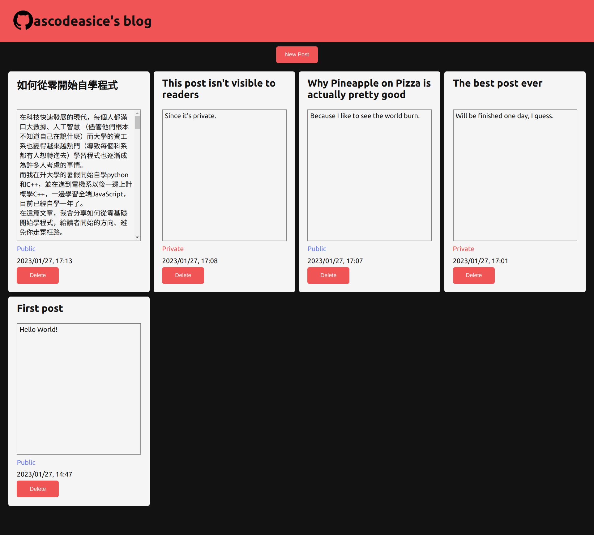

# blog-writer
A website that uses my blog api, and allows me to publish and edit blog posts.

I have to log in first, then I can edit my posts and visitors' comments

# Details
- Use my blog API ([repo](https://github.com/ascodeasice/blog-api))
- Use React.js framework
- Use MongoDB and Express.js for backend
# Results
## Home Page

## Edit Page

# Live Preview
[Link](https://ascodeasice.github.io/blog-writer/)

The link might not work because of backend hosting